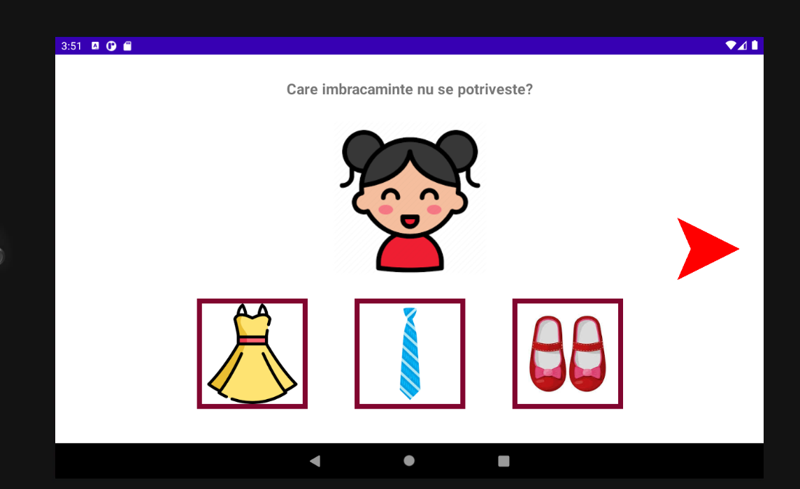
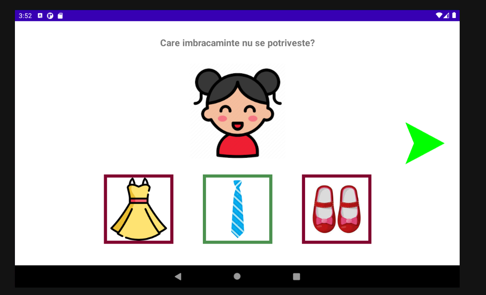
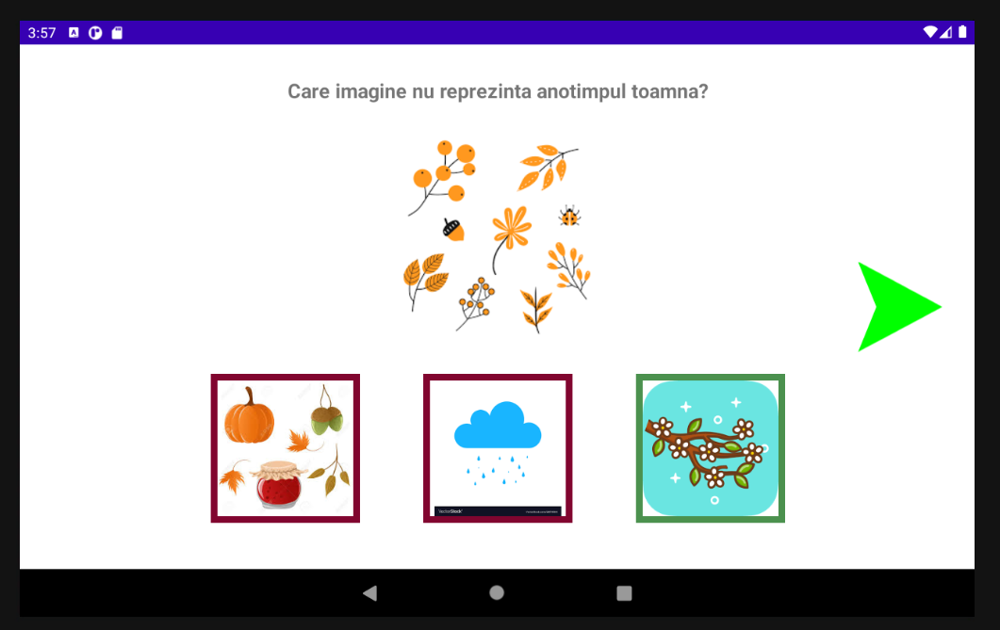
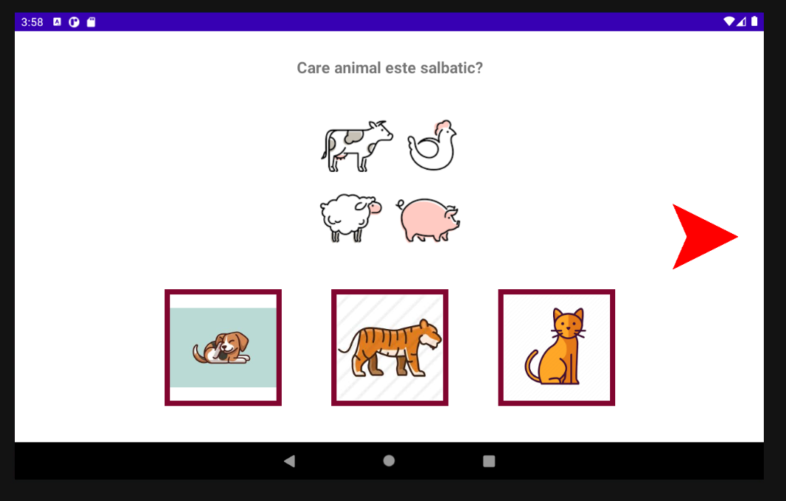
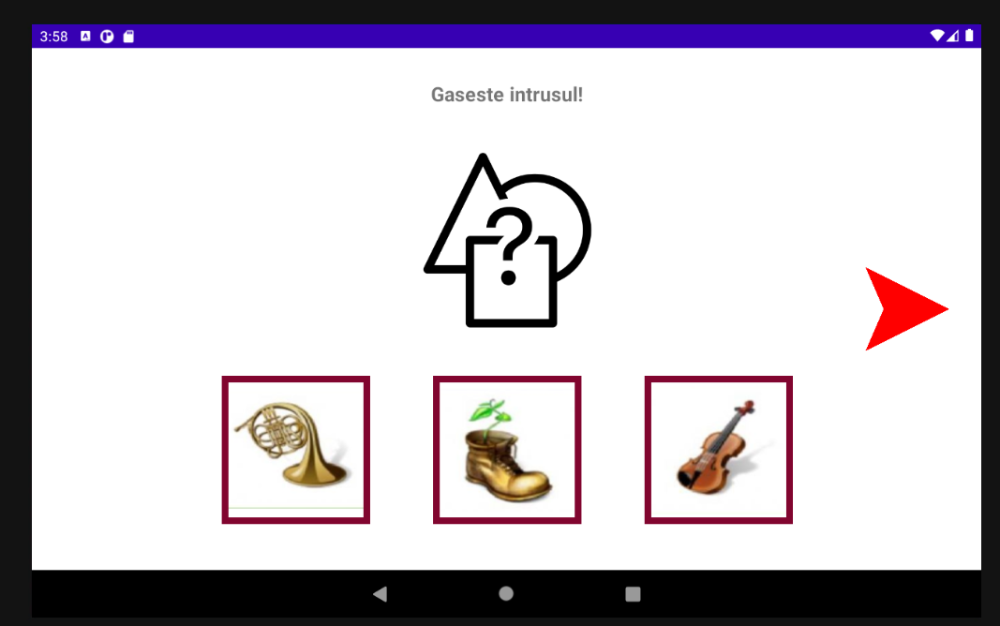
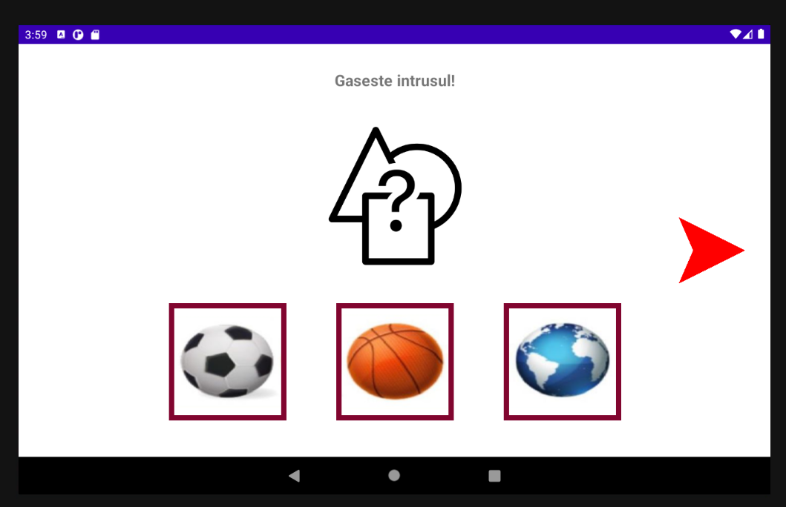
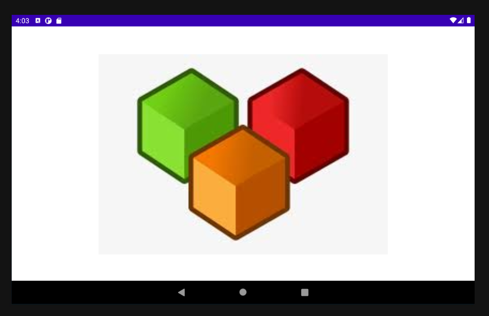
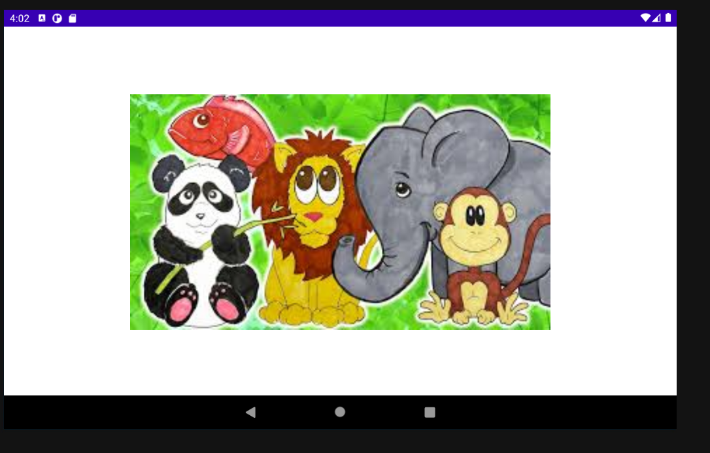
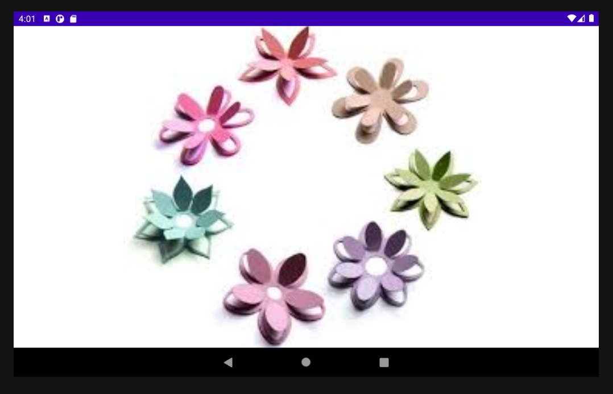
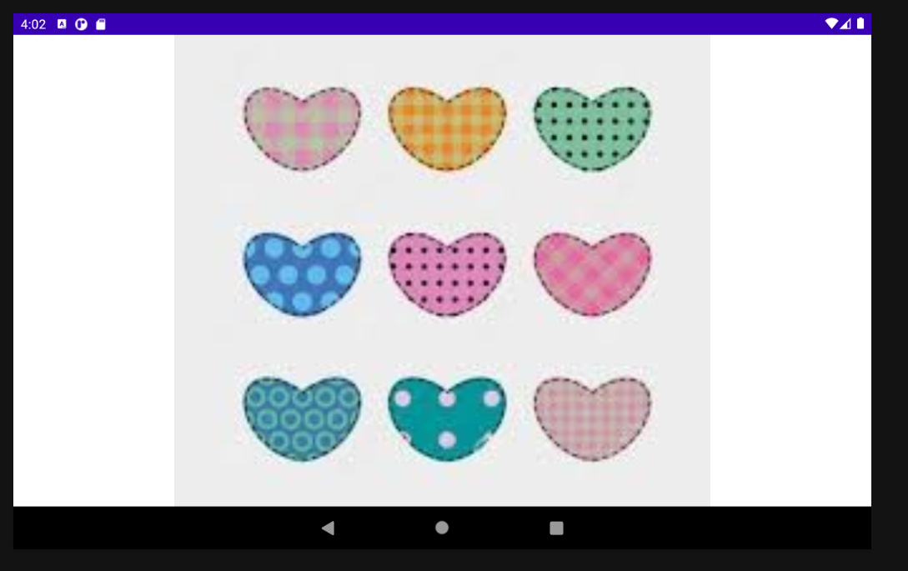

<!--
*** Thanks for checking out the Best-README-Template. If you have a suggestion
*** that would make this better, please fork the repo and create a pull request
*** or simply open an issue with the tag "enhancement".
*** Thanks again! Now go create something AMAZING! :D
-->


<!-- PROJECT SHIELDS -->
<!--
*** I'm using markdown "reference style" links for readability.
*** Reference links are enclosed in brackets [ ] instead of parentheses ( ).
*** See the bottom of this document for the declaration of the reference variables
*** for contributors-url, forks-url, etc. This is an optional, concise syntax you may use.
*** https://www.markdownguide.org/basic-syntax/#reference-style-links
-->
[![Contributors][contributors-shield]][contributors-url]
[![Forks][forks-shield]][forks-url]
[![Stargazers][stars-shield]][stars-url]
[![Issues][issues-shield]][issues-url]


<!-- PROJECT LOGO -->
<br />
<p align="center">

  <h3 align="center">Joc didactic</h3>

  <p align="center">
    Aplicație mobilă pentru elevii de clasa 0
    <br />
    <a href="https://github.com/EmanuelaIlie/JocDidactic"><strong>Explore the docs »</strong></a>
    <br />
    <br />
    ·
    <a href="https://github.com/EmanuelaIlie/JocDidactic/issues">Report Bug</a>
    ·
    <a href="https://github.com/EmanuelaIlie/JocDidactic/issues">Request Feature</a>
  </p>
</p>


<!-- TABLE OF CONTENTS -->
<details open="open">
  <summary>Cuprins</summary>
  <ol>
    <li><a href="#despre-proiect">Despre proiect</a></li> 
    <li><a href="#construit-cu">Construit cu</a></li>
    <li><a href="#cerințe">Cerințe</a></li>
    <li><a href="#instalare">Instalare</a></li>
    <li><a href="#utilizare">Utilizare</a></li>
    <li><a href="#contact">Contact</a></li>
    <li><a href="#sitografie">Sitografie</a></li>
  </ol>
</details>


<!-- ABOUT THE PROJECT -->
## Despre proiect

Aplicatia a fost creata pentru elevii de clasa 0, pentru materia "Matematica si cunoasterea mediului". Aceasta consta in alegerea raspunsului corect, din 3 variante posibile. 
Intrebarile se bazeaza pe principiul "Gaseste intrusul", cuprinzand mai multe sectiuni (animale, anotimpuri, imbracaminte, etc.).
Initial, raspunsurile au un contur rosu, urmand sa se schimbe culoarea dupa ce am ales un raspuns. La fel se intampla si cu butonul de "next".
La final, punctajul va fi interpretat printr-un numar de obiecte, pe care elevul, va trebui sa le numere.

### Construit cu

* [Android Studio](https://developer.android.com/studio)


### Cerințe

* Android Studio
  Se poate descarca de aici: https://developer.android.com/studio

### Instalare

Se clonează proiectul
   ```sh
   git clone (https://github.com/EmanuelaIlie/JocDidactic.git)
   ```

<!-- USAGE EXAMPLES -->
## Utilizare

Aici voi posta niște screen-shoturi pentru a ilustra cum se utilizează aplicația.

1. La început conturul răspunsurilor este roșu deoarece nu a fost selectat niciun răspuns.

<a href="https://github.com/EmanuelaIlie/JocDidactic">
    
  </a>

2. După ce s-a ales ceva, se face verde, la fel si butonul de next.

<a href="https://github.com/EmanuelaIlie/JocDidactic">
    
  </a>

3. Câteva dintre întrebările posibile.

<a href="https://github.com/EmanuelaIlie/JocDidactic">
    
  </a>
  
  <a href="https://github.com/EmanuelaIlie/JocDidactic">
    
  </a>
  
  <a href="https://github.com/EmanuelaIlie/JocDidactic">
    
  </a>
  
  <a href="https://github.com/EmanuelaIlie/JocDidactic">
    
  </a>
  
  <a href="https://github.com/EmanuelaIlie/JocDidactic">
    
  </a>

4. Interpretarea rezultatului prin număr de obiecte.

<a href="https://github.com/EmanuelaIlie/JocDidactic">
    
  </a>
  
  <a href="https://github.com/EmanuelaIlie/JocDidactic">
    
  </a>
  
  <a href="https://github.com/EmanuelaIlie/JocDidactic">
    
  </a>
  
  <a href="https://github.com/EmanuelaIlie/JocDidactic">
    
  </a>
                    


<!-- CONTACT -->
## Contact

Ilie Emanuela-Maria - [emanuela.ilie99@e-uvt.ro](emanuela.ilie99@e-uvt.ro)

Project Link: [https://github.com/EmanuelaIlie/JocDidactic](https://github.com/EmanuelaIlie/JocDidactic)


<!-- ACKNOWLEDGEMENTS -->
## Sitografie
* [icons8](https://icons8.com/icons/set/android)
* [GitHub Pages](https://pages.github.com)


<!-- MARKDOWN LINKS & IMAGES -->
<!-- https://www.markdownguide.org/basic-syntax/#reference-style-links -->
[contributors-shield]: https://img.shields.io/github/contributors/EmanuelaIlie/JocDidactic.svg?style=for-the-badge
[contributors-url]: https://github.com/EmanuelaIlie/JocDidactic/graphs/contributors
[forks-shield]: https://img.shields.io/github/forks/EmanuelaIlie/JocDidactic.svg?style=for-the-badge
[forks-url]: https://github.com/EmanuelaIlie/JocDidactic/network/members
[stars-shield]: https://img.shields.io/github/stars/EmanuelaIlie/JocDidactic.svg?style=for-the-badge
[stars-url]: https://github.com/EmanuelaIlie/JocDidactic/stargazers
[issues-shield]: https://img.shields.io/github/issues/EmanuelaIlie/JocDidactic.svg?style=for-the-badge
[issues-url]: https://github.com/EmanuelaIlie/JocDidactic/issues
